# 19款你可能没听过的顶级AI网站采集工具

从网站上抓取数据已经成为营销流程中越来越重要的一环。无论你需要提取什么类型的数据来优化内部流程,现在都有越来越多的工具能帮你高效且精准地完成工作。如今,AI网站采集器的出现,进一步降低了使用门槛,让那些掌握其威力的营销人员受益匪浅。

虽然采集工具学起来可能有点棘手,甚至需要一些编码技能,但它们并没有你想象的那么复杂。开发公司设计它们时就考虑到了通用性,能够适用于各种不同场景。

---

## 什么是网站采集器?

多年前,公司必须手动访问网站来收集有价值的信息。首先,他们得创建一个相关网站列表,然后逐个访问以收集联系数据和其他有价值信息。幸运的是,当网站采集器出现后,这一切都成为了历史。

这些强大的工具通过自动为复杂网站生成数据,大大简化了提取过程。例如,它们可以根据你输入的关键词或与你网站、社交媒体账户的关联来浏览网站。它们还能筛选在线评论、产品描述等各种类别。

我个人最喜欢PhantomBuster。这个多功能工具可以通过浏览你的LinkedIn联系人或利用关键词筛选社交媒体平台来提取信息。不过,根据你的具体需求,你可能需要一些不太一样的东西。

## 什么是AI网站采集器?

AI驱动的网页抓取已经显著改变了整个流程。你不仅能获得更准确的数据提取,现在还可以处理动态网站和内容。鉴于人工智能持续改进其流程,你能随着时间推移获得越来越好的结果。

AI工具的另一个主要优势体现在自然语言处理上。现代软件能够理解某些短语和句子背后的语境,这在解析客户反馈和各种评论以及分类数据时非常宝贵。

除了拥有强大功能外,我喜欢先进AI工具能够绕过验证码并模仿类似人类的浏览模式。这样,你可以最大化数据收集,并确保最高的数据质量和相关性。

## AI网站采集器的使用场景

无论你有一个普通网站、电子商务公司,还是经营营销代理机构,AI驱动的网站采集器都能提供巨大价值。这些是这些出色的人工智能程序最常见的使用场景:

- 潜在客户生成
- 情感分析
- 声誉管理
- 竞争对手分析
- 价格分析
- 财务数据分析
- 招聘信息聚合
- 联系信息提取
- 产品数据提取
- 新闻监控

基于这一切,这些多功能工具对于做出明智决策和执行各种复杂任务至关重要。虽然它们对于自动化拓展至关重要,但也可以在公司早期发展和研究阶段提供帮助。即使在后期,你也可以使用它们来监控在线讨论和品牌认知。

## 19款最佳AI网站采集器

这个软件领域极其多样化,因为这个概念已经存在了一段时间。只要你使用正确的产品,你几乎可以找到任何问题的解决方案。在接下来的部分,我将介绍一些最好的AI网页抓取工具,以及它们与列表上其他工具的区别。

### 1. Octoparse

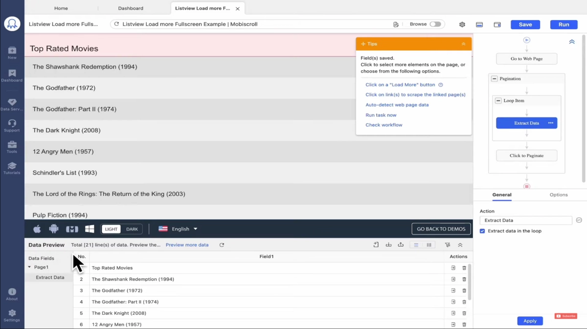

鉴于其复杂性,Octoparse不需要任何编码技能几乎令人难以置信。这个AI驱动的网页抓取平台允许你根据特定需求创建工具。例如,你可以利用该平台进行潜在客户生成、社交媒体内容和产品详情提取、内容整理等。

通过依赖其关键功能,你可以访问几乎任何网络数据。该软件提供IP轮换和验证码解决方案,可以绕过任何潜在限制。更棒的是,你还可以利用针对最受欢迎网站和行业的各种预制模板,使你的抓取过程更快。

### 2. ParseHub

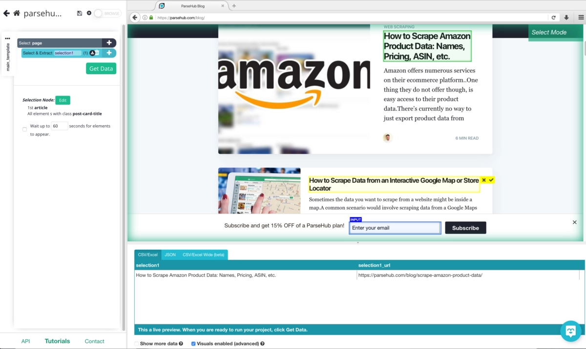

ParseHub是处理动态内容的完美解决方案。该软件可以浏览AJAX和JavaScript页面以提供有价值的业务数据。这个AI工具可以分析各种文件格式,点击下拉菜单和地图,以及处理弹出窗口和标签页。ParseHub的人工智能算法擅长理解元素层次结构并专注于相关信息。

除了常规文本,该工具还可以访问HTML和属性。我真正喜欢它的一点是,你还可以下载图像,这在所有网站抓取工具中并不常见。之后,你可以以JSON或CSV格式将数据下载到你的计算机上。

### 3. Apify

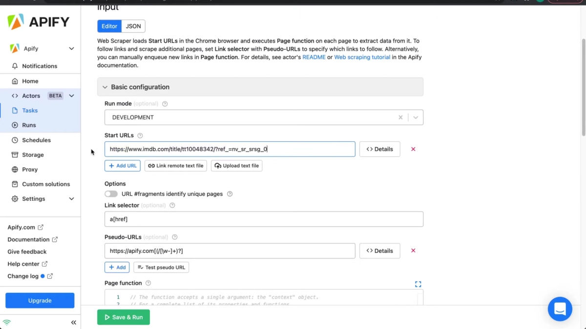

与Octoparse类似,Apify允许你为在线业务构建和实施复杂的采集器。该公司还有一个在线商店,存储由其他用户制作的各种程序。例如,你可以获得一个用于浏览Google搜索引擎结果的采集器、Amazon产品采集器、AI产品匹配器以及许多其他实用工具。

要充分利用这个软件,你应该至少具备一些编程技能。该平台与Python和JavaScript等流行编程语言配合良好,允许你为业务创建定制解决方案。你还可以引入代理轮换来绕过保护。

### 4. Import.io

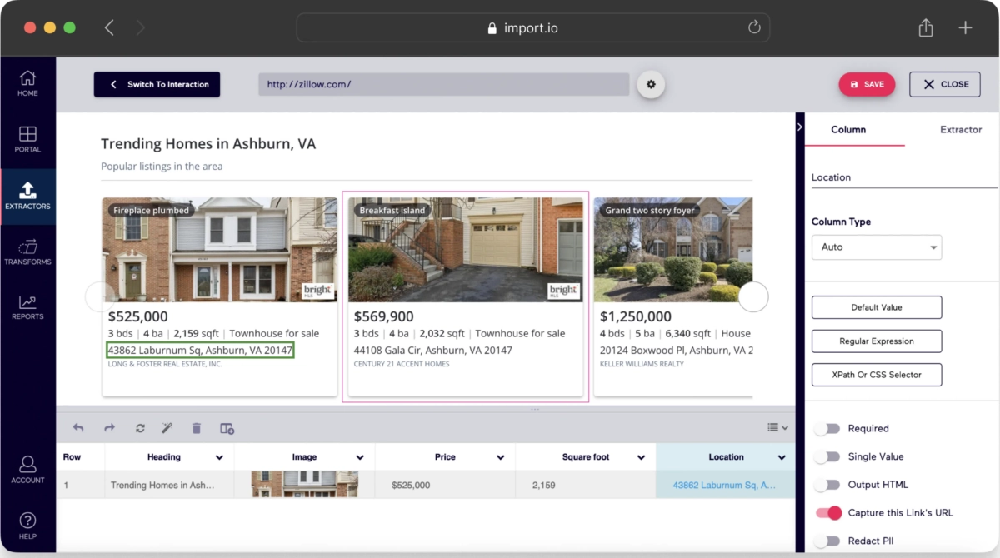

Import.io利用简单的点击界面并提供API,因此你可以为业务创建定制解决方案。该软件具有许多高级功能,使提取变得更好。其中,它使用多URL训练来识别不同的页面变体。它还提供自动优化功能,提高数据质量并加快提取过程。

高级用户应该查看屏幕捕获功能,它允许你保存从中抓取数据的页面。另一个值得一提的是提取调度,这对于执行定期抓取的公司来说是理想的。完成任务后,你可以以JSON、CSV或Google Sheets格式下载数据。

### 5. Scraper API

这个令人惊叹的工具可以提取搜索引擎结果和来自电子商务网站的数据。尽管与其他采集器提供的相比,使用案例数量有所限制,但这个工具通过智能代理轮换弥补了这一点。👉 [想要全球范围内稳定抓取数据?试试这个强大的解决方案](https://www.scraperapi.com/?fp_ref=coupons),拥有50多个地理位置和全球4000万个IP,你可以轻松从几乎任何页面或博客文章中提取数据。

我还喜欢这个AI工具的速度。Scraper API可以消除效率低下的代理,专注于提供最快响应的代理。这样,你可以确保永远不会被阻止,并且流程尽可能顺利进行。

### 6. Scraping Bee

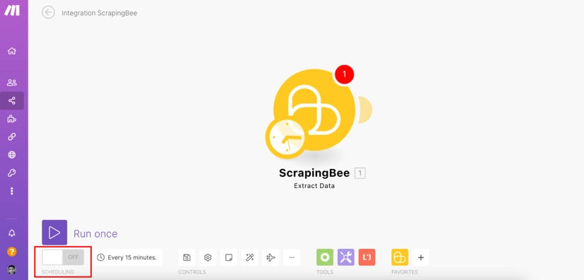

虽然Scraping Bee不需要编码技能,但该软件也支持JavaScript渲染。有了它,你可以执行独特的操作,让你从工具中获得显著更多的价值。

通过依赖这个AI平台的用户友好界面,你可以轻松创建用于分析竞争对手定价、检查黄页、监控用户交互以及执行其他任务的工具。换句话说,你可以创建复杂的工作流程,作为自适应抓取的基础。

Scraping Bee是想要绕过地理限制的企业主的热门选择。除此之外,我还想赞扬该公司的客户支持和工具的API可靠性。

### 7. Scrapy

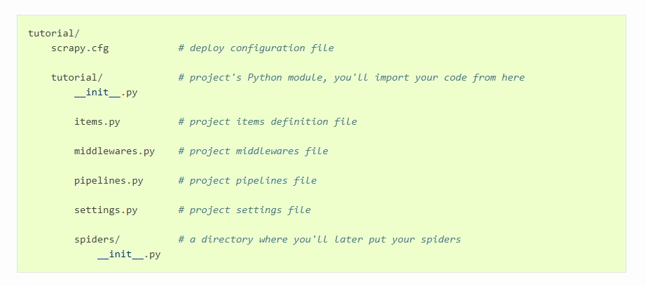

Scrapy是一个为爬取各种网页而量身定制的开源框架。尽管它只支持Python,但许多人仍然喜欢它的简单性、速度和异步方法。因此,它是几乎任何类型大规模抓取的完美解决方案。虽然该平台优先考虑抓取,但你也可以将其用于其他任务,例如测试。

在Scrapy中,开发人员可以编程蜘蛛并指示它们如何浏览页面和提取数据。说到突出功能,你总是可以从请求优先级、自动请求重试和调度功能中受益。其中,Scrapy可以处理重定向、会话、错误和cookie。

### 8. Diffbot

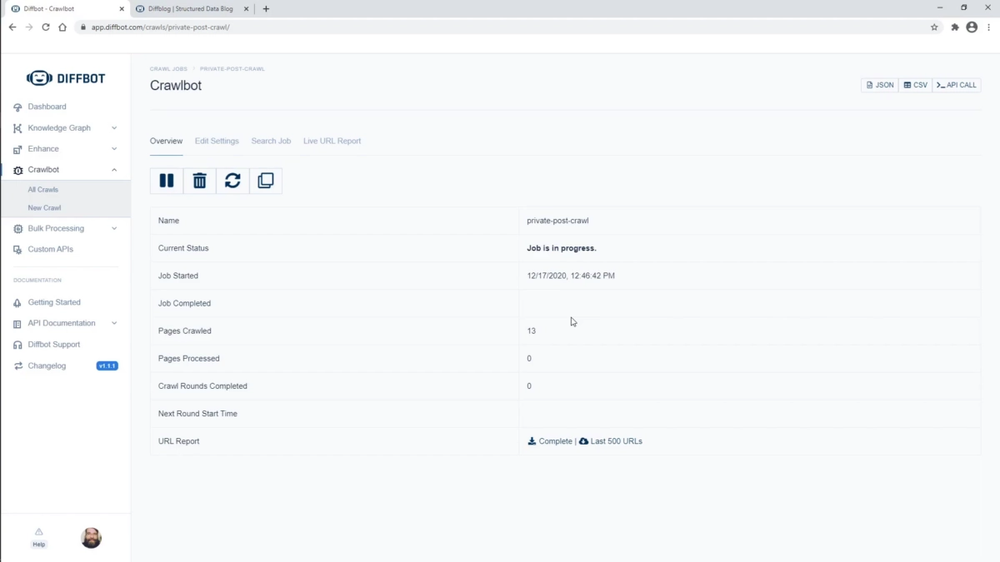

Diffbot的高级算法可以处理几乎任何在线请求。有了这个软件,你可以创建创新的方法来从博客文章、新闻稿、网站、产品页面、在线论坛和客户评论中抓取数据。

在浏览不同平台和内容时,你可以完全控制数据字段。例如,如果你使用Diffbot进行竞争分析,你可以提取产品图片和价格、规格、数量、颜色和其他参数。同样,该软件允许你在组织抓取期间分析公司的收入、位置和投资。

通过其语言模型,这个AI驱动的网页抓取平台可以为你的公司提取更有价值的见解,并理解文字背后的语境。Diffbot相对于其他工具的一个主要优势是它不太受网站设计变化的影响。

### 9. ScrapeStorm

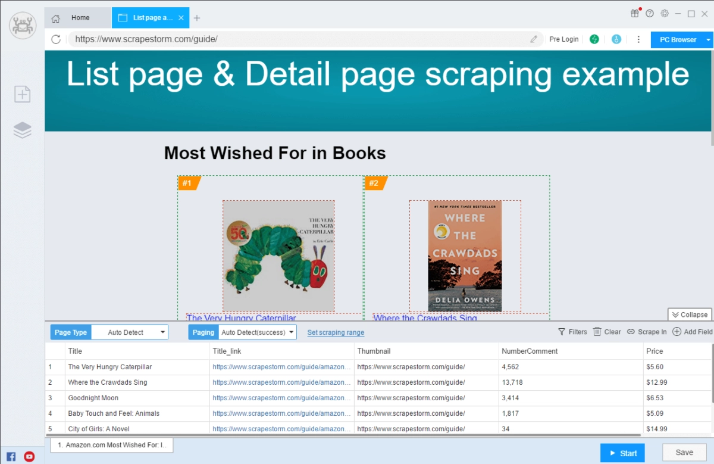

ScrapeStorm提供有价值网站数据的自动导出。它可以生成链接、图片、电子邮件、电话、产品价格和表单等列表。我欣赏这个程序的一点是,它可以自动从其他文件中提取URL并将它们用于内部流程。

创建表格和数据框并引入第一个URL后,软件将自动填充其余内容。该软件可以访问"隐藏"数据,如无限列表,并点击分页按钮以查找其他AI网站采集器不容易获得的信息。

### 10. Dexi

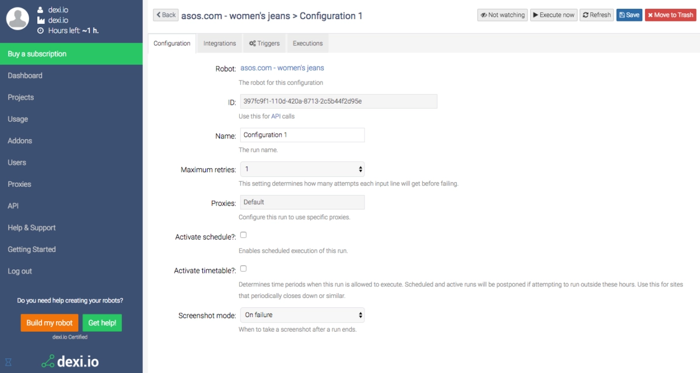

Dexi是一个数字智能平台,提供的远不止简单的抓取。将它与其他工具区分开来的是它对网上购物的重视。除了标准的价格、图片和技术规格提取外,Dexi还可以分析网站上的所有横幅和广告。

这个高级AI程序还有一些有趣的位置功能。它可以分解不同城市和地区的产品可用性和价格,这对较大的企业来说非常宝贵。更棒的是,该公司还提供托管服务,这对于没有专门IT部门的品牌来说非常宝贵。

### 11. Instant Data Scraper

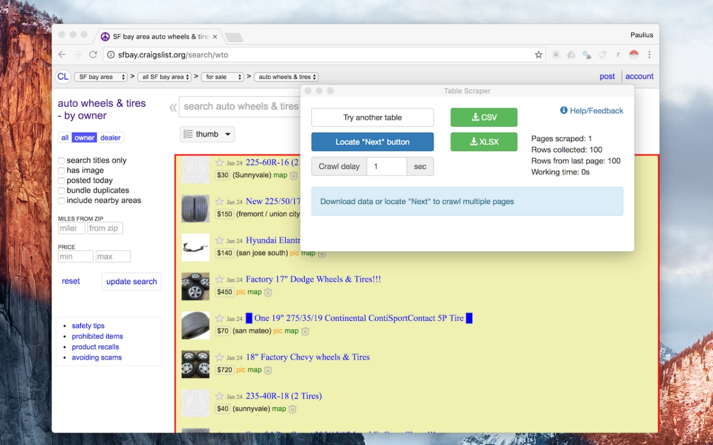

与此列表上的大多数其他AI网站采集器工具不同,Instant Data Scraper相当简单,需要最少的技术知识。该软件以浏览器扩展的形式提供,你可以即时使用它来执行较小的抓取任务。

该软件使用一种特殊的技术。访问特定页面并激活扩展后,该工具将针对特定数据并将其放入Excel或CSV表格中。如果你对输出不满意,可以再次运行软件以获得不同的数据集。最重要的是,这个工具是免费的,可以用于多个网站。

### 12. Byteline

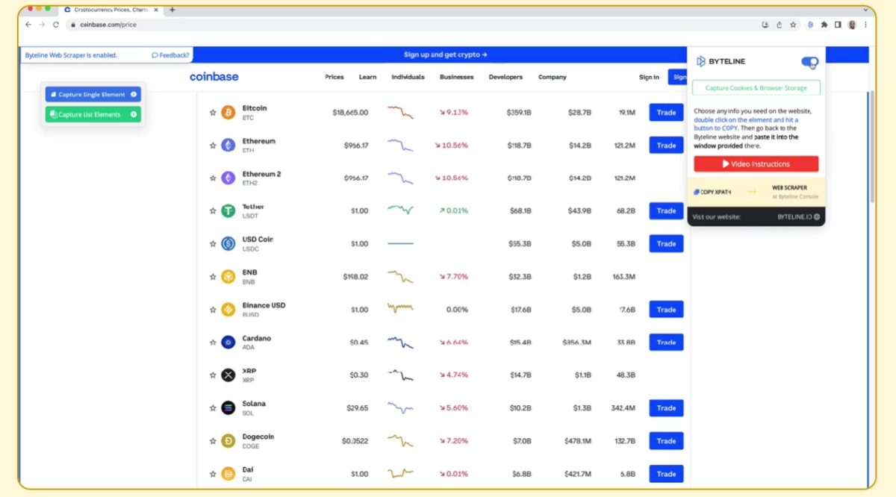

与Instant Data Scraper类似,Byteline以Chrome扩展的形式出现。它允许你标记任何网站上的特定数据进行提取,稍后可以在工具的控制台中修改。该程序还允许进一步分页和提取其他URL。

你也可以使用这个软件安排抓取。Byteline适应任何设计变化,还可以克服验证码阻止。通过在各种IP地址之间交替,你可以确保永远不会被代理阻止程序盯上。

### 13. Webscraper.io

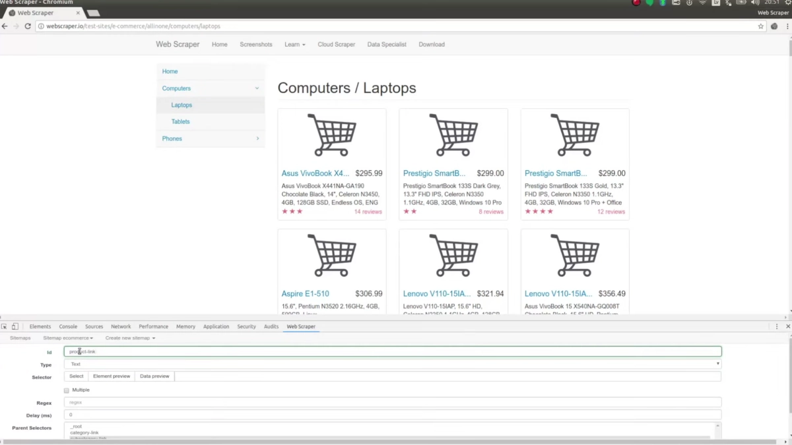

Webscraper.io的奇妙之处在于它在点击式前提下工作。换句话说,你可以选择页面上要收集的特定数据,并在CSV、XLSX或JSON文件中呈现。最重要的是,你不需要编码技能就能从软件中获得最大价值。

根据你的初始提示,你可以创建构建器来浏览数千个竞争对手的页面。我特别喜欢这个的一点是,你可以免费获得一个Chrome扩展(仅用于本地抓取)。

### 14. Data Miner的Data Scraper

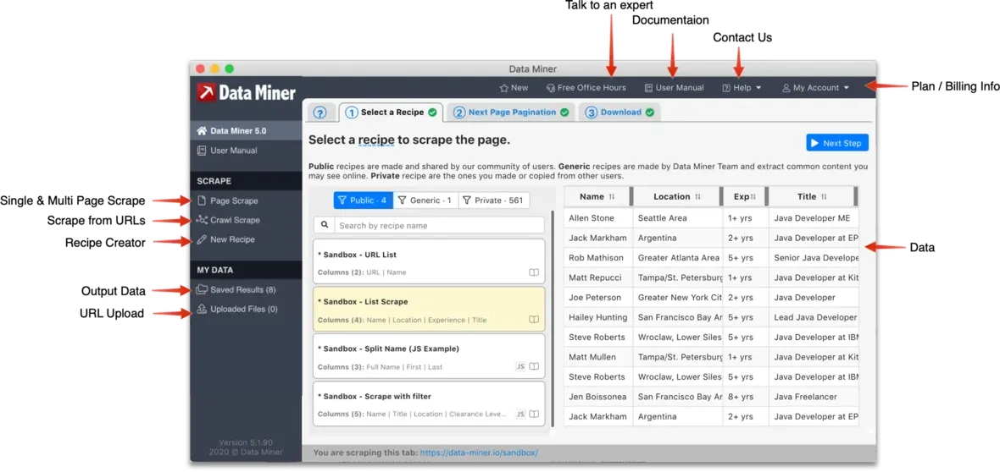

Data Miner的Data Scraper是一款简单直观的软件,非常适合初学者。将它与竞争对手区分开来的一点是大量预制模板。你可以利用50,000多个预制使用案例,适用于15,000多个最大网站。如果这不起作用,你总是可以创建自定义查询。

该软件模仿人类行为,因此使用该平台时不太可能被阻止。此外,该程序会向你显示特定URL是否可以被抓取,这样你就不会浪费时间。我还喜欢它的单击抓取,这可以为你节省很多时间。

### 15. Outwit Hub

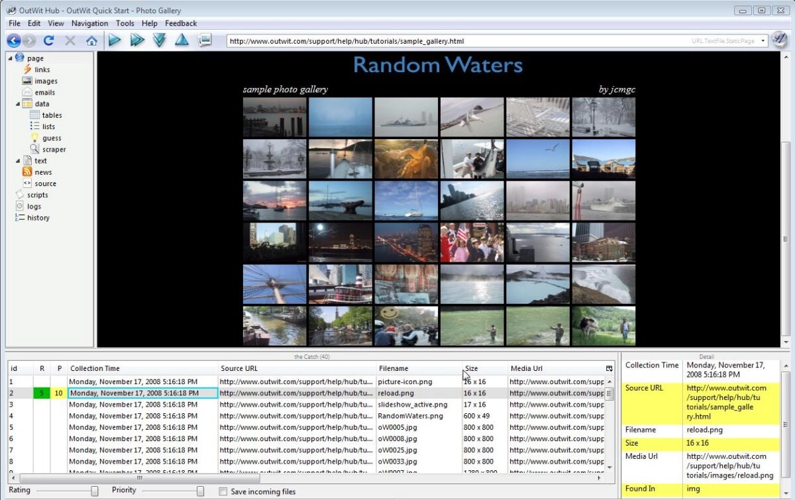

这个通用工具可以服务于几乎任何业务类型和企业家。例如,它是从各种网站抓取联系人的完美解决方案。人们还用它进行电子商务抓取、SEO分析、求职、社交媒体监控、图像提取和声誉管理。

由于其精细化的关注点,该软件对高级用户来说要好得多。你可以提取从临时数据提取到常规提取、博客和社交媒体帖子抓取的任何信息。图像直接下载到磁盘,而其他数据可以保存为Excel、HTML和CSV文件。

### 16. ScrapingBot

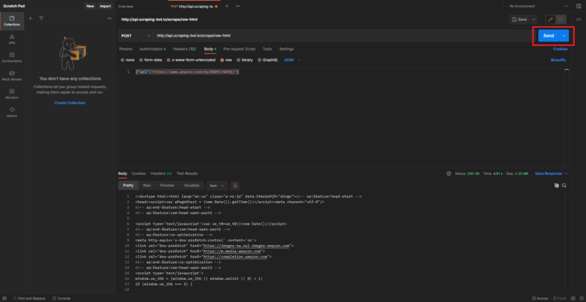

在访问公司网站时,你会注意到他们为不同的使用案例销售单独的API。你可以购买房地产采集器、电子商务工具、原始HTML软件、Instagram、LinkedIn和搜索引擎软件等等。值得注意的是,所有提取的数据都以HTML格式返回,使该工具更适合拥有开发人员的团队。

该软件允许JavaScript渲染。通过API技术,你可以轻松地将ScrapingBot引入其他解决方案,从而更容易简化你的营销工作。除了潜在客户生成外,该程序还非常适合价格监控、情感分析、社交媒体营销和其他活动。

### 17. Grepsr

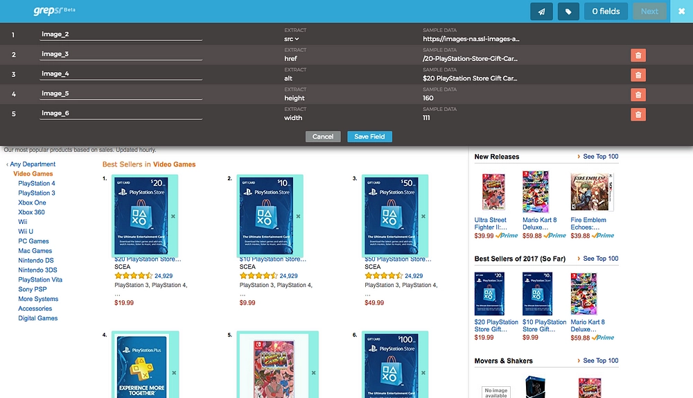

区分这个平台的是它对人工劳动的部分依赖。该公司的质量保证团队可以进一步分析数据并提供定制解决方案,确保你为业务获得正确的见解。他们还可以提取最有价值的指标,并以易于利用的方式呈现它们。

与其他软件类似,这个工具利用代理来克服网站保护。最重要的是,由于其复合方法,Grepsr提供了更准确的数据输出。也许它最好的功能是历史比较,它允许你将当前数据与过去数据进行基准测试。

### 18. Bright Data

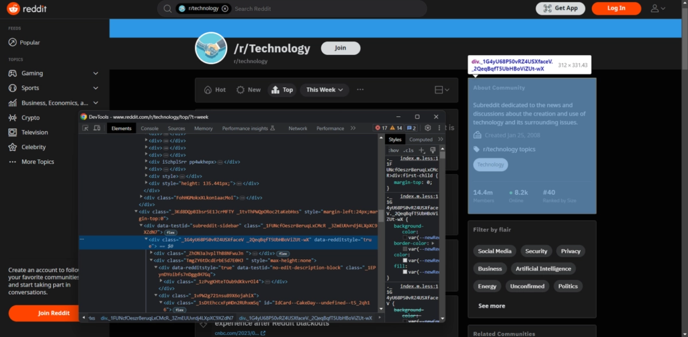

Bright Data不需要任何技术知识。该软件为你提供各种模板,允许你为你的行业抓取专业数据。或者,公司团队可以创建专门的数据集来满足你特定的品牌需求。

该软件的主要卖点之一是集成。Bright Data与所有编程语言、商业智能工具和其他相关程序配合使用。这样,你可以以最小的努力简化提取过程,而不会中断当前的工作流程。

### 19. Bardeen.ai

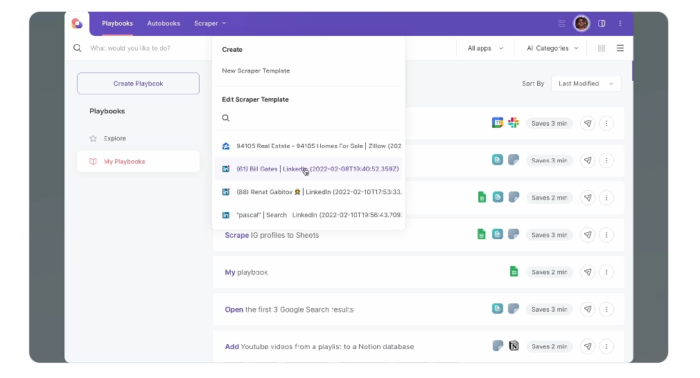

通过利用AI的力量,Bardeen.ai可以创建和修改抓取工作流程。你不仅可以创建独特的模板,还可以将多个工具引入指定流程。这样,你可以确定使用哪个软件进行编码、在哪里上传数据以及使用哪个程序进行共享。

使用该软件时,你可以完全控制要抓取的元素。除了纯文本,你还可以创建链接、图片、标题和各种页面上的其他内容列表。不同抓取模型和代理的组合可以确保完整的数据检索,同时绕过所有障碍。

---

## 结语

希望通过浏览我的AI网站采集器列表,你学到了一些新东西。这些工具中的大多数已经存在了十多年,甚至在AI成为热点之前。换句话说,这些都是可靠的程序,可以最大化你的抓取过程,并确保你获得最大的投资回报。

无论你是需要进行竞争对手分析、价格监控,还是潜在客户生成,👉 [ScraperAPI都能为你的数据采集需求提供稳定可靠的解决方案](https://www.scraperapi.com/?fp_ref=coupons)。凭借其智能代理轮换和全球IP覆盖,它是处理大规模网页抓取任务的理想选择。
